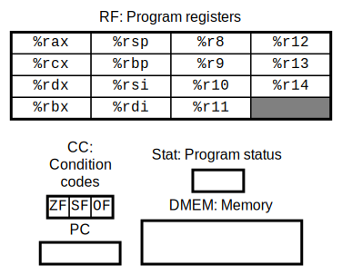
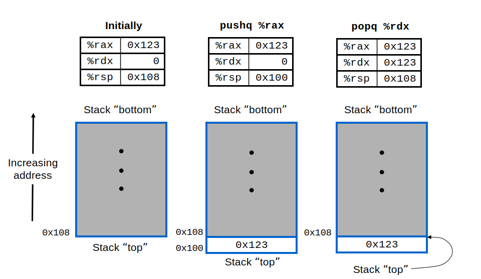
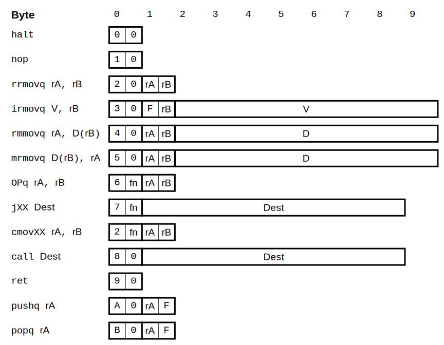

# Lab2: Y86-64 模拟器

本次实验中我们将实现一个简单的 Y86-64 处理器模拟器。

## 实验流程

**1. 阅读实验文档**：通读本文档，熟悉 Y86-64 模拟器的核心概念，包括[处理器状态](#处理器状态)、[指令编码和功能](#指令编码和功能) 以及 [模拟器流程与状态码](#模拟器流程与状态码)。

**2. 熟悉代码框架**：使用 CLion 或 VS Code 打开项目，阅读各头文件中的注释，理解各模块的职责划分。（[文件结构](#文件结构)）

**3. 实现核心逻辑**：补全 `simulator.cpp` 中的 `next_instruction()` 函数，完成各类指令的取指、译码与执行逻辑。（[任务与参考代码](#任务与参考代码)）

**4. 调试与测试**：对模拟器进行调试，并使用测试脚本完成批量功能验证。（[测试](#测试)）

**5. 提交代码**：批量测试全部通过后，将所有 .cpp 和 .h 文件打包为压缩包，上传至 Canvas 平台。（[提交](#提交)）

## 实验概况

### 输入

模拟器的输入是一个**二进制格式**的文件（不是文本文件），文件里包含若干条 **Y86-64 指令**。

用 CLion 或者 VS Code 打开项目，会自动提示安装二进制编辑器的插件（CLion 的 *BinEd* 或者 VS Code 的 *Hex Editor*）。用插件打开 `y64-app` 目录下面的 `poptest.bin`，可以看到文件的内容以 16 进制显示：

```ldif
# poptest.bin

0x000: 30 f4 00 01 00 00 00 00 00 00 30 f0 cd ab 00 00
0x010: 00 00 00 00 a0 0f b0 4f 00
```

其中 `30`、`f4`、`00`……各表示一个字节。每行开头的 `0x000`、`0x010` 表示这行内容的起始地址（偏移量）。整个文件一共有 25 个字节。

### 输出

在我们正确实现模拟器后，可以将 `poptest.bin` 作为输入来运行，运行后会输出以下信息：（可以打开同目录下的 `poptest.out` 查看）

```
Stopped in 5 steps at PC = 0x18.  Status 'HLT', CC Z=1 S=0 O=0
Changes to registers:
%rax:	0x0000000000000000	0x000000000000abcd
%rsp:	0x0000000000000000	0x000000000000abcd

Changes to memory:
0x00000000000000f8:	0x0000000000000000	0x000000000000abcd
```

可以看到模拟器运行了 5 步后，在 `PC = 0x18` 的位置停机，同时输出了其状态（Status）和条件码（CC）。

另外，相比开始运行前，有两个寄存器（registers）的值发生了变动：`%rax` 和 `%rsp`。内存（memory）地址为 `0xf8` 的值也发生了变动。

### 输入解释

二进制格式的输入阅读起来比较困难，因此我们提供了对应的文本文件来解释其中的内容。打开同目录下的 `poptest.yo` 可以看到：（文件里 `#` 符号之后的内容是注释，这里直接略过）

```ldif
# poptest.yo

0x000: 30 f4 00 01 00 00 00 00 00 00 | irmovq $0x100,%rsp
0x00a: 30 f0 cd ab 00 00 00 00 00 00 | irmovq $0xABCD,%rax
0x014: a0 0f                         | pushq  %rax
0x016: b0 4f                         | popq   %rsp
0x018: 00                            | halt
```

其中每一行都代表一条**指令**。竖线左侧的是这条命令对应的起始地址和字节序列，可以在 `poptest.bin` 里找到对应的部分。Y86-64 每条指令的长度（字节数）是不一样的。

竖线右侧是这条命令的**汇编代码**，可以让我们更容易地理解每条指令的含义。其中，`irmovq`、`pushq` 等代表指令要执行什么**操作**；`$0x100`、`%rsp` 是指令的**操作数**。在操作数中，类似 `$0x100` 等 `$` 开头的是**数值**，而类似 `%rsp` 等 `%` 开头的是**寄存器**。

注意，处理器（模拟器）只能处理二进制格式的指令，汇编代码只是用来方便我们阅读和调试的。

<details>
<summary>补充知识：二进制里面，数值的字节顺序好像是反的？</summary>

细心的同学可能会发现，汇编指令里面的数值（例如 0xABCD）在指令的二进制里面是反过来编码的（`cd ab`）。这涉及数值存储时的**字节序**（Byte Order）。

**本次实验中相关的读写函数都已经实现好，同学们需要编写的代码不涉及字节序的内容。**

Y86-64 指令集采用的是**小端序**（Little Endian），一个数值的低位字节储存在前面（低地址），高位字节储存在后面（高地址）。目前广泛使用的处理器架构（例如 x86、ARM 等）均采用小端序。

与之相反的是**大端序**（Big Endian），一个数值的高位字节储存在前面，低位字节储存在后面。大端序在人类阅读时比较直观，但在计算机内部处理时比较复杂。

| 整数 | 小端序（64 位，16 进制） | 大端序（64 位，16 进制） |
| :---: | :---: | :---: |
| 0x100 (= 256) | `00 01 00 00 00 00 00 00` | `00 00 00 00 00 00 01 00` |
| 0xABCD | `cd ab 00 00 00 00 00 00` | `00 00 00 00 00 00 ab cd` |
| 0x1234567890ABCDEF | `ef cd ab 90 78 56 34 12` | `12 34 56 78 90 ab cd ef` |

大端序、小端序只涉及**一个数值内部**的**字节之间**的顺序。用数组保存多个数值时，顺序不会改变；每个字节内部的顺序也是不变的。

大端序、小端序的名称来源于《格列佛游记》里面小人国争论鸡蛋应该从大的一端敲开还是从小的一端敲开。

</details>

## Y86-64 模拟器的实现

<details>
<summary>补充知识：CPU</summary>

**CPU**（中央处理器）是计算机的"大脑"。CPU 的每个核心在工作时，会源源不断地从**内存**中取出二进制形式的**指令**（Instruction），并做出相对应的操作，例如将寄存器中的两个数相加，或者从内存中将某个数读取到寄存器中。

**寄存器**（Register）是 CPU 内部临时储存数据的部件，每个核心一般有 8~32 个通用寄存器，每个寄存器可以临时保存一个整数。寄存器的实际读写速度比内存快几百倍。

**ALU**（算数逻辑单元）是 CPU 内部用来执行算数和逻辑运算的部件。计算数字的加减乘除、与或非、异或、位移等运算都要依赖 ALU。

现代 CPU 一般内置了内存控制器，用来读写与 CPU 相连的**内存**（Memory）。目前主流的个人计算机一般会配备 16~64 GiB 的内存。

这些核心部件（CPU、内存）、其他重要部件（硬盘、显卡等）、外设（显示器、键盘、鼠标等）共同组成了计算机。

</details>

<details>
<summary>补充知识：Y86-64 指令集</summary>

不同用途、不同生产商的 CPU，其指令的编码方式和长度、处理的整数位数、整数的存储格式等可能会有所不同，这些规格称为**指令集**（Instruction Set），有时也称为架构或者平台。例如，采用 64 位指令集的 CPU 处理的是 64 位二进制整数，其寄存器和内存地址都是 64 位。

**Y86-64** 是一个简单的"玩具"性质的 64 位指令集，其原型来自于 x86-64 指令集，不过经过了大幅简化和修改，与 x86-64 有很多不同之处。

x86-64（简称 x64，也叫 AMD64）是目前广泛使用的一种 64 位复杂指令集（CISC）。x86-64 架构的处理器市场份额最大的是 Intel 和 AMD。与复杂指令集相对应的是精简指令集（RISC），例如 ARM 和 RISC-V，其中 ARM 架构在移动设备领域占据主导地位。

Y86-64 来源于《深入理解计算机系统》（*Computer Systems: A Programmer's Perspective*，简称 CSAPP）教材。本次实验不需要同学们参考阅读。

</details>

### 处理器状态

<p align="center">
    
</p>


如图所示，我们要实现的 Y86-64 模拟器在运行时会保存以下状态：

- **寄存器**（Program registers）：一共有 15 个寄存器，分别是 `%rax`, `%rcx`, `%rdx`, `%rbx`, `%rsp`, `%rbp`, `%rsi`, `%rdi`, `%r8` 到 `%r14`，它们从 0~14 依次编号，16 进制下就是 0x0~0xE。每个寄存器可以保存一个 64 位整数。

<details>
<summary>补充知识：为什么是 15 个？</summary>

现今广泛使用的 x86-64 架构中有 16 个通用寄存器。Y86-64 作为它的简化和修改版，省略了 %r15 寄存器，用来方便指令编码。

</details>

- **条件码**（Condition Codes, CC）：一共有 3 个条件码，每个占 1 位，记录了最近一次**算数逻辑运算**的效果。

<details>
<summary>补充知识：各个条件码的含义</summary>

- ZF=1（Zero Flag）表示上一次运算的结果为 0，否则 ZF=0。
- SF=1（Sign Flag）表示上一次运算的结果为负数，否则 SF=0。
- OF=1（Overflow Flag）表示上一次运算发生了溢出，否则 OF=0。

</details>

- **PC**（Program Counter）：保存了当前正在执行的指令地址。
- **内存**（Memory）：保存了程序的指令和数据。可以想象成一个巨大的 byte 数组。本次实验中，内存的大小定为 8 KiB，只有在这个范围内的内存地址才是有效的。
- **状态码**（Program status）：记录了指令是否正常执行。如果发生了某些异常（Exception），例如遇到了格式不正确的无效指令，或者某条指令访问的内存地址无效，就会往这里写入异常状态码。

<details>
<summary>补充知识：关于图中的缩写</summary>

- RF 是 Register File（寄存器堆）的缩写，与 CPU 的硬件实现有关。
- DMEM 应该是指 Data Memory（数据内存）。某些 CPU 的指令和数据会分开保存，不过 Y86-64 实际并不区分。

</details>

### 模拟器流程与状态码

模拟器初始化时，寄存器、内存、PC 都会清零。模拟器会将二进制的指令文件加载到内存中（地址从 0 开始）。

模拟器运行时，会不断地重复以下步骤：

1. **取指和解码**：处理器会从 PC 指向的内存地址读取指令，解读这条指令的类型、操作数等信息。
2. **执行指令**：例如将寄存器中的两个数相加，或者从内存中将某个数读取到寄存器中。这部分在[指令编码和功能](#指令编码和功能)一节有详细说明。
3. **更新 PC**：将 PC 设置为下一条指令的地址。
4. **更新状态码**：指令正常执行完成时，状态码是 `AOK`。其他情况下，需要返回异常代码，如下表所示。一旦遇到非 `AOK` 的代码，我们的模拟器就停止运行。

| 代码 | 含义 |
| :---: | :--- |
| `AOK` | 指令正常执行，处理器继续运行 |
| `HLT` | 遇到了 `halt` 指令，停机 |
| `ADR` | 取指或者访存的地址无效 |
| `INS` | 指令格式错误，无法解读 |

### 栈操作

部分指令会涉及到栈操作，感兴趣的同学可以点开查看其详细过程和原理。

<details>
<summary>补充知识：程序运行栈</summary>


程序运行时，会将内存中的一块区域划定为"栈"（Stack），用来保存一些临时数据。这个栈与数据结构中的栈有相似之处，数据只能从栈顶"压入"或"弹出"。与通常的栈不同的是，程序运行栈是从高地址向低地址增长的，栈顶位置由 `%rsp` 寄存器记录，其中 sp 是 stack pointer 的缩写。

<p align="center">
    
</p>

如图中左侧所示，初始状态下，假设栈底的地址是 0x200，栈顶的地址 `%rsp` 是 0x108。可以发现，栈顶的内存地址确实小于（低于）栈底的内存地址。

此时，我们将 `%rax` 寄存器中的 8 字节的数值压入栈中，得到中间的状态。我们将 `%rsp` 指针向低地址移动了 8 个字节，变成了 0x100，并且我们在 0x100 开始的 8 个字节保存了 `%rax` 寄存器中的数值 0x123。

最后，我们将栈顶的值弹出，保存到 `%rdx` 寄存器中，得到右侧的状态。我们将原本 `%rsp` 指针指向的数值 0x123 保存到 `%rdx` 寄存器中，并且将 `%rsp` 指针向高地址移动了 8 个字节，变成了 0x108。内存地址小于 0x108 的部分就被排除在栈之外（虽然没有清空里面的数值）。

</details>

### 指令编码和功能

<p align="center">
    
</p>

如图所示，Y86-64 指令长短不一，根据种类不同，占据 1~10 个字节，属于变长指令。图中每一小格是 4 位（半个字节），最上方标注了指令内部的偏移字节数。注意，4 位无符号整数可以表示的范围是 0~15，也就是 16 进制下的 0x0~0xF。

每条指令的第 1 个字节表明了它的**类型**：

- 高 4 位是"**指令码**"（code）部分，范围是 0x0~0xB。例如，如果这 4 位是 0x9，那么这条指令就是 `ret` 指令。
- 低 4 位是"**指令功能**"（function）部分，只有部分指令使用到，如下图所示。例如，如果高 4 位是 0x6，低 4 位是 0x1，那么这条指令就是 `subq` 指令。

有些指令的长度不止 1 个字节。例如 `rrmovq` 指令，其作用是将寄存器 rA 的值复制到寄存器 rB 中。这条指令的第 2 个字节就指明了 rA 和 rB 具体是哪两个**寄存器**，其中高 4 位是 rA 的编号，低 4 位是 rB 的编号，如下表所示。部分指令只用到一个寄存器，另一个就用 0xF 来表示。

| 编号 | 名称 | 编号 | 名称 |
| :---: | :---: | :---: | :---: |
| 0 | `%rax` | 8 | `%r8` |
| 1 | `%rcx` | 9 | `%r9` |
| 2 | `%rdx` | A | `%r10` |
| 3 | `%rbx` | B | `%r11` |
| 4 | `%rsp` | C | `%r12` |
| 5 | `%rbp` | D | `%r13` |
| 6 | `%rsi` | E | `%r14` |
| 7 | `%rdi` | F | 无寄存器 |

有些指令还需要一个 8 字节（64 位）的常数，一般称为**立即数**（immediate）。例如 `irmovq` 指令，其作用是将立即数 V 保存到 rB 寄存器中，因此 rA 的位置就设置成 0xF，并在后面接上 8 个字节的 V 数值。

接下来说明各条指令的功能和要求。

#### 0 - `halt`

停机，PC 不再移动到下一条指令，条件码设为 `HLT`。

#### 1 - `nop`

无操作（no-op, no operation），继续执行下一条指令。

#### 2:0 - `rrmovq rA, rB`

当 function（首字节的低 4 位）为 0 时，代表 `rrmovq` 指令，将寄存器 rA 的值复制到寄存器 rB 中。

rA 和 rB 必须有效。

#### 3 - `irmovq V, rB`

将立即数 V 保存到寄存器 rB 中。

rA 必须为 0xF，rB 必须有效。

#### 4 - `rmmovq rA, D(rB)`

将寄存器 rA 中的值写入内存，内存地址是立即数 D + 寄存器 rB 的值。

书写汇编代码时，D 可以省略，表示 D = 0。

例如，rA 保存的值是 0x1234，rB 保存的值是 4，立即数 D 是 0x100，那么这条指令就会在内存地址 0x104 开头的 8 个字节的范围写入整数 0x1234。

rA 必须有效。本次模拟器要求 rB 有效。内存地址必须有效。

#### 5 - `mrmovq D(rB), rA`

将内存中的值读取到寄存器 rA 中，内存地址是立即数 D + 寄存器 rB 的值。

书写汇编代码时，D 可以省略，表示 D = 0。

rA 必须有效。本次模拟器要求 rB 有效。内存地址必须有效。

#### 6 - 算数逻辑运算

根据 function 的值，执行不同的算数逻辑运算（框架中定义了 `AluOp`），如下表所示。

| 首字节 | 指令 | 操作 |
| :---: | :---: | :---: |
| 6:0 | `addq rA, rB` | rB ← rB + rA |
| 6:1 | `subq rA, rB` | rB ← rB - rA |
| 6:2 | `andq rA, rB` | rB ← rB & rA |
| 6:3 | `xorq rA, rB` | rB ← rB ^ rA |

例如，`subq rA, rB` 就是将 rB 与 rA 的差值保存到 rB 中。

这条命令还需要将运算的效果写入条件码（CC）。

**条件码的计算已经实现好，请直接调用 `ConditionCodes::compute()` 函数。**

rA 和 rB 必须有效。

#### 7 - 无条件跳转、条件跳转（分支）

根据 function 的值，查询条件码（CC），如果满足条件，则将 PC 跳转到 `Dest` 地址，否则不跳转，继续执行下一条指令。

**条件码是否满足跳转条件的逻辑已经实现好，请直接调用 `ConditionCodes::satisfy()` 函数，例如 `if (cc.satisfy(cond)) { ... }`。**

| 首字节 | 指令 | `static_cast<Condition>(ifun)` |
| :---: | :---: | :---: |
| 7:0 | `jmp Dest` | `Condition::YES` |
| 7:1 | `jle Dest` | `Condition::LE` |
| 7:2 | `jl Dest` | `Condition::L` |
| 7:3 | `je Dest` | `Condition::E` |
| 7:4 | `jne Dest` | `Condition::NE` |
| 7:5 | `jge Dest` | `Condition::GE` |
| 7:6 | `jg Dest` | `Condition::G` |

<details>
<summary>补充知识：条件跳转（分支）指令如何发挥作用？</summary>

条件跳转（分支）指令前面通常会有一条 `subq rA, rB` 指令，跳转的条件就是这两个寄存器中的数值 rB 和 rA 的关系。请看下面这个例子：

```elm
subq %rax, %r8
jle  $0x200
```

这两条指令的组合就实现了：如果 `%r8 ≤ %rax`，那么就跳转到 `0x200` 地址继续执行指令。其中的 `LE` 后缀代表"小于等于"（Less than or Equal to）。


| 后缀 | 条件表达式 | 等价于前一条 `subq` 指令 |
| :---: | :---: | :---: |
| (YES) | `1` | 无条件跳转 |
| `LE` | `SF^OF \| ZF` | rB - rA ≤ 0 |
| `L` | `SF^OF` | rB - rA < 0 |
| `E` | `ZF` | rB - rA = 0 |
| `NE` | `~ZF` | rB - rA ≠ 0 |
| `GE` | `~(SF^OF)` | rB - rA ≥ 0 |
| `G` | `~(SF^OF) & ~ZF` | rB - rA > 0 |

</details>

#### 2:X - 条件移动

根据 function 的值，查询条件码（CC），如果满足条件，则将 rA 的值复制到 rB 中，否则不复制。function 和条件的对应关系与跳转命令相同。2:0 相当于无条件复制，即 `rrmovq`。

| 首字节 | 指令 | `static_cast<Condition>(ifun)` |
| :---: | :---: | :---: |
| 2:0 | `rrmovq rA, rB` | `Condition::YES` |
| 2:1 | `cmovle rA, rB` | `Condition::LE` |
| 2:2 | `cmovl rA, rB` | `Condition::L` |
| 2:3 | `cmove rA, rB` | `Condition::E` |
| 2:4 | `cmovne rA, rB` | `Condition::NE` |
| 2:5 | `cmovge rA, rB` | `Condition::GE` |
| 2:6 | `cmovg rA, rB` | `Condition::G` |

rA 和 rB 必须有效。

#### 8 - `call Dest`

将下一条指令的地址（next PC）压入栈中，然后将 PC 跳转到 `Dest` 地址。

压栈时，首先将数值写入内存地址为 `%rsp - 8` 的位置，然后再 `%rsp ← %rsp - 8`。

栈操作的详细过程可以在[栈操作](#栈操作)一节中学习。

#### 9 - `ret`

从栈中弹出返回地址，然后将 PC 跳转到这个地址。

弹栈时，首先成功读出内存地址为 `%rsp` 的数值，然后 `%rsp ← %rsp + 8`。

#### A - `pushq rA`

将 rA 中的值压入栈中。

rA 必须有效，rB 必须为 0xF。

需要保证，执行 `pushq %rsp` 时，压入栈中的是旧的（没有减 8 的）数值。

#### B - `popq rA`

将栈顶的值弹出，保存到 rA 中。

rA 必须有效，rB 必须为 0xF。

若 `rA` 为 `%rsp`，则需要保证 `%rsp` 中保存的是弹出的数值。这条命令的效果相当于 `mrmovq (%rsp), %rsp`。

## 文件结构和任务

### 文件结构

所有**头文件**（`*.h`）中都写有**注释**，开始任务之前请仔细阅读。

- `registers.h`, `registers.cpp` - 寄存器相关逻辑。
- `memory.h`, `memory.cpp` - 内存相关逻辑。
- `instructions.h`, `instructions.cpp` - 指令编码中的数值、条件码。**条件码的计算、是否满足，这些逻辑已经实现好。**
- `simulator.h` - 模拟器状态码的定义、`Simulator` 类的声明。方法实现分散在 `simulator.cpp` 和 `simulator_utils.cpp` 两个文件中。
- `simulator.cpp` - 模拟器 `Simulator` 运行的主要逻辑。
- `simulator_utils.cpp` - 其他辅助方法。**这里提供了所有需要的错误输出语句，方法名类似`report_*()`，可以直接调用。** **`error_invalid_reg()` 和 `error_valid_reg()` 可以用来检查寄存器是否有效，同时输出错误信息。**
- `main.cpp` - 主程序。从命令行读取要执行的 `.bin` 文件名，以及最多执行步数（可以省略）。之后会构造一个 `Simulator`，将二进制文件读取到 `Simulator` 的内存中，备份其寄存器和内存状态，然后开始运行。运行结束后，会输出寄存器和内存的变动情况。
- `tester.py` - 用来批量检查输出是否正确的 Python 脚本。用法参考[测试脚本](#测试脚本)一节的说明。
- `y64-app`, `y64-ins` 目录 - 保存了所有测例。`y64-ins` 是各条指令单独的测试，`y64-app` 是综合了多种指令的应用程序测试。
  - `*.bin` 是二进制的指令文件（输入）。
  - `*.out` 是输出结果（参考输出）。
  - `*.yo` 以文本格式并排展示了指令和汇编代码。
- `y64-ref` 目录 - 包含编译好的参考程序。测试脚本会使用到，请勿移动或者删除。

### 任务与参考代码

本次任务为补全 `simulator.cpp` 中的 `Simulator::next_instruction()` 函数，代码框架如下所示。你只需在 `switch` 语句中，为各指令实现对应的 `case` 分支，完成其执行流程即可。

`Simulator::next_instruction()` 中`rrmovq`指令执行的代码已经实现，供大家参考。

```cpp
Status Simulator::next_instruction() {
  uint64_t next_pc = pc;

  // get code and function (1 byte)
  const std::optional<uint8_t> codefun = memory.get_byte(next_pc);
  if (!codefun) {
      report_bad_inst_addr();
      return Status::ADR;
  }
  const auto icode = static_cast<InstructionCode>(get_hi4(codefun.value())); // 通过 get_hi4() 获取高四位，得到 icode
  uint8_t ifun = get_lo4(codefun.value()); // 通过 get_lo4() 获取低四位，得到 ifun
  next_pc++;

  // execute the instruction
  switch (icode) {
      case InstructionCode::HALT: // 0:0
      {
          return Status::HLT;
      }
      case InstructionCode::NOP: // 1:0
      {
          pc = next_pc;
          return Status::AOK;
      }
      case InstructionCode::RRMOVQ: // 2:x regA:regB
      {
          const std::optional<uint8_t> regs = memory.get_byte(next_pc); // 从内存中读取保存寄存器 id 的字节
          if (!regs) {
              report_bad_inst_addr(); // 若读取失败则通过 report_bad_inst_addr() 输出错误信息
              return Status::ADR; // 返回 Status::ADR，表示取指的地址无效
          }

          const uint8_t reg_a = get_hi4(regs.value()); // 高 4 位为 ra
          const uint8_t reg_b = get_lo4(regs.value()); // 低 4 位为 rb
          // 验证 ra 和 rb 是否符合预期，不符合则输出错误信息
          // 对于 rrmovq，ra 和 rb 必须有效，则使用 error_invalid_reg 验证，在遇到无效寄存器时输出错误信息
          // 对于要求 ra 或 rb 为 0xf 的指令，使用 error_valid_reg 来验证
          if (error_invalid_reg(reg_a)) return Status::INS;  // 返回 Status::INS 表示指令格式错误
          if (error_invalid_reg(reg_b)) return Status::INS;
          next_pc++; // 将 PC 指向下一字节

          // 判断当前状态码是否满足条件
          if (cc.satisfy(static_cast<Condition>(ifun))) { 
            // 条件满足，执行赋值操作
            registers[reg_b] = registers[reg_a];
          }

          pc = next_pc; // 将 pc 更新为下一条指令的地址
          return Status::AOK; // 返回 Status::AOK 表示指令正常执行
      }
      case InstructionCode::IRMOVQ: // 3:0 F:regB imm
      case InstructionCode::RMMOVQ: // 4:0 regA:regB imm
      case InstructionCode::MRMOVQ: // 5:0 regA:regB imm
      case InstructionCode::ALU: // 6:x regA:regB
      case InstructionCode::JMP: // 7:x imm
      case InstructionCode::CALL: // 8:0 imm
      case InstructionCode::RET: // 9:0
      case InstructionCode::PUSHQ: // A:0 regA:F
      case InstructionCode::POPQ: // B:0 regA:F
          return Status::INS; // TODO: unsupported now, replace with your implementation
      default:
          report_bad_inst(codefun.value());
          return Status::INS;
  }
}
```

#### 错误处理要求

实现指令时，**必须正确处理各种错误情况**，这是测试的一部分：

1. **返回正确的状态码**：
   - `Status::AOK` - 指令正常执行
   - `Status::HLT` - 遇到 `halt` 指令
   - `Status::ADR` - 取指或访存地址无效（如内存越界、栈地址无效）
   - `Status::INS` - 指令格式错误（如无效寄存器、无效指令码）

2. **使用 `report_*` 函数输出错误信息**：
   - 取指地址无效 → 调用 `report_bad_inst_addr()`
   - 数据地址无效（rmmovq/mrmovq）→ 调用 `report_bad_data_addr(addr)`
   - 栈地址无效（pushq/popq/call/ret）→ 调用 `report_bad_stack_addr(sp)`
   - 无效指令码 → 调用 `report_bad_inst(inst)`
   - 寄存器验证使用 `error_invalid_reg()` 或 `error_valid_reg()`（它们内部在检测失败时，已调用 `report_bad_reg`）

**注意**：部分测试用例会触发错误，如果你的程序没有正确输出错误信息，测试将会失败。请调用给出的 `report_*` 接口输出错误信息，保证其格式与参考输出完全一致。

## 测试

### 输入输出格式

运行模拟器时，以**命令行参数**形式传入 `.bin` 文件的路径；程序不会读取 `stdin`。

模拟器会向 `stdout` 输出错误信息和停机时的状态。具体格式可以参考测例中的 `*.out` 文件。

代码框架已经写好了大部分的输出，**同学们只需要在执行指令发生异常时（即返回状态码不是 `Status::AOK` 时）打印错误信息即可**。错误信息的输出函数也都已经写好，请同学们阅读 `simulator.h` 文件中的 `error_*()` 和 `report_*()` 方法；这些方法的实现位于 `simulator_utils.cpp`。

`stdout` 的输出内容必须与参考输出完全一致，不能有任何调试信息。如果需要输出调试信息，请向 `stderr` 输出，例如：

```cpp
std::cerr << "info";
```

### CLion 调整运行配置

为了方便在 CLion 中运行调试，可以按照以下步骤调整运行配置，传入命令行参数：

1. 点击右上角程序名称的下拉菜单，点击"编辑配置…"。
2. 填写"程序实参"。由于 CLion 默认会在 `cmake-build-debug` 目录下运行程序，填写目录时需要先用 `..` 返回上一级目录（`lab2`），例如：
   ```
   ../y64-app/poptest.bin
   ```
   我们的模拟器还可以填写第二个参数，用来指定最多执行的步骤。这样填写就可以指定最多执行 12 步：
   ```
   ../y64-app/poptest.bin 12
   ```
3. 点击"确定"保存配置。


**提示**：其他实验可能需要从 `stdin` 读取输入。在上图的"重定向输入自:"选项指定包含输入内容的 `.txt` 文件即可让程序自动从这个文件读取输入。

### 测试脚本

`tester.py` 脚本可以用来批量测试。需要先安装 Python 3.7 以上版本才能运行。Linux 和 macOS 一般已经预装。

使用 Windows 的同学可以[点击这里下载 Python 3.13 安装程序](https://registry.npmmirror.com/-/binary/python/3.13.2/python-3.13.2-amd64.exe)运行安装。**安装时请务必勾选"Add python.exe to PATH"选项**。安装完成后请重启 IDE/代码编辑器。


**批量测试之前，请先点击右上角的"构建"按钮编译程序**。编译完成后，点击窗口左下角的"终端"按钮，在命令行输入以下命令并回车，即可运行脚本。

- Windows：`python tester.py`
- macOS/Linux：`python3 tester.py`

脚本会依次将所有测例输入给你的程序，并检查输出是否正确。输出不正确的测例显示如下，其中 `*** ****` 开始的上面半段是你的输出，`--- ----` 开始的下面半段是参考输出。在输出中，`!`/`+`/`-` 开头的行是你的输出与参考输出不一致的地方。

```diff
[FAILED] y64-ins\popq.bin: stdout mismatch
*** stdout
--- expected
***************
*** 1,5 ****
! Stopped in 1 steps at PC = 0x0.  Status 'INS', CC Z=1 S=0 O=0
  Changes to registers:
  
  Changes to memory:
- 0x0000000000000200:   0x0000000000000000      0x0000000000000200
--- 1,6 ----
! Stopped in 2 steps at PC = 0x2.  Status 'HLT', CC Z=1 S=0 O=0
  Changes to registers:
+ %rsp: 0x0000000000000000      0x0000000000000008
+ %rbp: 0x0000000000000000      0x0000000000005fb0
  
  Changes to memory:
```

也可以用测试脚本来测试某一个测例运行指定步数的结果，只需要传入测例的文件名（不需要完整路径）和步数即可。例如，测试 `popq.bin` 最多 30 步的运行结果：

- Windows：`python tester.py popq.bin 30`
- macOS/Linux：`python3 tester.py popq.bin 30`

## 提交

将所有 `.cpp` 和 `.h` 文件打包成 `.zip` 或者 `.7z` 压缩包，上传到 Canvas 平台。也可以直接打包整个目录，对压缩包内部目录结构没有要求。

本实验可以多次提交，会定时自动评测。

**请在提供的代码框架中编写代码，不要自行新建源代码文件。评测系统不会编译新建的文件。**

## C++ 新特性介绍

本次实验框架使用的是 C++20 标准，用到了一些新特性，在此简要介绍。

### [`[[nodiscard]]`](https://en.cppreference.com/w/cpp/language/attributes/nodiscard) (C++17)

给函数标记 `[[nodiscard]]` 之后，如果调用函数但是忘记使用其返回值，编译器会警告或者报错。

<details>
<summary>如何丢弃返回值（不推荐）</summary>

如果确实要丢弃返回值，可以将其强转成 `void`：

```cpp
(void)call_nodiscard();
```

</details>

### [`std::optional<T>`](https://en.cppreference.com/w/cpp/utility/optional) (C++17)

表示一个可能为空的 `T` 类型的值。使用 `std::nullopt` 可以构造一个空值：

```cpp
#include <optional>

int values[8]; // 保存了一些随机数值

std::optional<int> get(int index) {
    if (index < 0 || index >= 8) { // 下标越界
        // 返回 -1 是不安全的，因为 values 里面可能有这个值
        return std::nullopt; // 返回空值
    }
    return values[index]; // 返回正常值
}
```

处理 `std::optional` 时，可以用 `!` 判断是否为空；如果非空，可以用 `value()` 方法获得里面的值：

```cpp
void run(int index) {
    std::optional<int> result = get(index);
    if (!result) { // result 是空值
        std::cout << "invalid index";
        return;
    }
    std::cout << result.value();
}
```

### [`std::array<T, N>`](https://en.cppreference.com/w/cpp/container/array) (C++11)

固定常数大小的容器。可以像一个 `std::vector` 来使用。

```cpp
#include <array>

void run() {
    std::array<int, 4> arr = {1, 2, 3, 4};
    // 类似于 int arr[4] = {1, 2, 3, 4};
    std::cout << arr.front() << arr.back() << arr.at(1);
    // 输出 142
}
```

### [`std::format()`](https://en.cppreference.com/w/cpp/utility/format) (C++20)

格式化输出函数，语法类似于 Python，用 `{}` 来表示要输出的参数。编译时会检查参数的数量和类型是否正确。

```cpp
#include <format>

void run() {
    std::cout << std::format("<{:x}|{}>", 10, 3.14);
    // 输出 <a|3.14>
    // {:x} 表示十六进制输出
}
```
